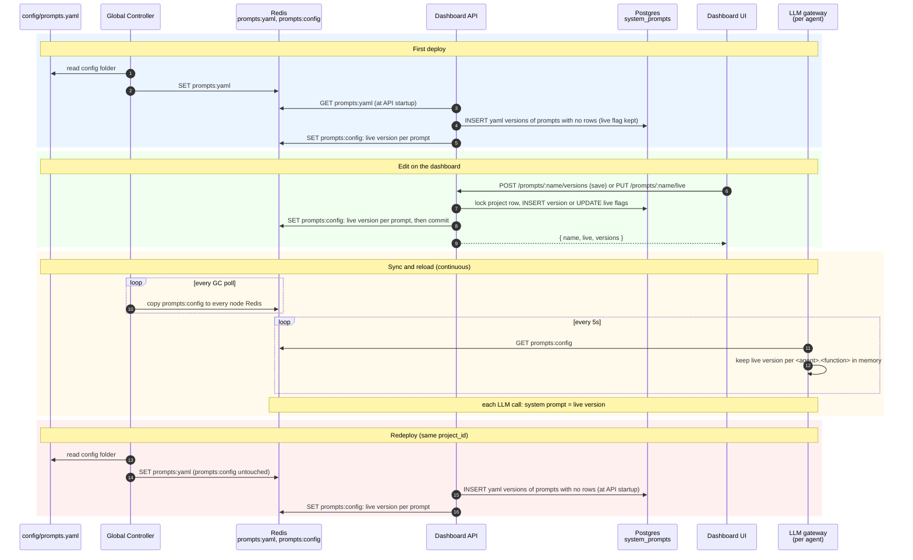

# LLM Gateway — Architecture

## Where it runs

```
┌──────────────────────────── agent replica container ────────────────────────────┐
│                                                                                  │
│   ┌──────────────────────────────┐            ┌──────────────────────────────┐   │
│   │  Local Controller            │  starts    │  LLM gateway                 │   │
│   │  (app venv)                  ├───────────▶│  /opt/canyonos-gateway venv  │   │
│   │                              │ subprocess │  python -m                   │   │
│   │  gateway_headers.install()   │            │    canyonos_core.llm_gateway │   │
│   │  at startup (future-id hdr)  │  /healthz  │                              │   │
│   │                              │◀───────────┤  127.0.0.1:8081              │   │
│   │  ┌────────────────────────┐  │            │                              │   │
│   │  │ agent code             │  │   HTTP     │                              │   │
│   │  │ OpenAI / Anthropic SDK ├──┼───────────▶│                              │   │
│   │  │ boto3 bedrock-runtime  │  │            │                              │   │
│   │  └────────────────────────┘  │            └──────┬────────────────┬──────┘   │
│   └──────────────────────────────┘                   │                │          │
│                                                      │ tokens, policy │ real     │
└──────────────────────────────────────────────────────┼────────────────┼──────────┘
                                                       ▼                ▼
                                              ┌──────────────┐   ┌─────────────────┐
                                              │  node Redis  │   │  api.openai.com │
                                              │ future:<id>  │   │  api.anthropic  │
                                              │ llms:config  │   │  bedrock-runtime│
                                              └──────────────┘   └─────────────────┘
```

The gateway runs in its own separate VM, with two extra libraries installed: requests and ... to prevent images built from having more canyonos dependencies.

All LLM calls supported by us go through the gateway, defaulting to the normal LLM call if something is ever wrong with the gateway (just with no telemetry).

Our gateway is able to obtain LLM telemetry from every call made, as well as implement policies on requests going through, such as auth, limits, etc..

Current supported providers are: OpenAI, Anthropic, AWS Bedrock.

The below diagrams go into more depth into different components specific to the proxy.

## Modules

```
__main__.py ──▶ config.py  Config.from_env()
     │
     ▼
app.py  create_app()
     ├──▶ providers/__init__.py  build_registry()
     │         ├── "openai"    ──▶ providers/openai.py     (HttpProvider)
     │         ├── "anthropic" ──▶ providers/anthropic.py  (HttpProvider)
     │         └── "bedrock"   ──▶ providers/bedrock.py    (only if boto3 installed)
     ├──▶ hooks.py  Hooks(cfg)  ──▶ redis.Redis
     ├──▶ routing.py  start_refresh(redis)  ──▶ llms:config every 5s
     │
     ├── GET  /healthz
     └── ANY  /<provider>/<path>  ──▶ core.py  proxy_request(hooks, ...)
                                        ├──▶ hooks.on_request
                                        ├──▶ routing.route            (allow-list, cost cap)
                                        ├──▶ provider.forward
                                        └──▶ hooks.on_response

routing.py ──▶ pricing.py ──▶ llm_prices.json

controller/gateway_headers.py ── installed by the Local Controller, not the gateway server
controller/utils/otel_writer.py ──▶ llm_gateway/pricing.py   (dashboard cost)
```

## Request path

```
agent SDK call
     │
     ▼
POST 127.0.0.1:8081/<provider>/<subpath>
     │
     ▼
app.dispatch ── unknown provider ──▶ 404
     │
     ▼
core.proxy_request
     │
     ├─▶ Ctx { provider, method, subpath, body, headers, t0, model }
     ├─▶ hooks.on_request(ctx) ──▶ log
     │
     ├─▶ routing.route(model_id, body) ──denied──▶ 403 denied_response ──┐
     │                                                                   │
     ├─▶ provider.forward ──────────────────────────────────────┬◀───────┘
     │                                                          ▼
     │                                                   GatewayResponse
     │                                           ┌──────────────┴──────────────┐
     │                                      content                         stream
     │                                           │                             │
     │                               hooks.on_response            relay chunks to agent
     │                                           │                             │
     │                                           ▼                  stream ends (finally)
     │                                    Response to agent                    │
     │                                                             hooks.on_response
     │
     └─ any exception ──▶ 502 gateway_error
```

## Providers

```
                          Provider.forward(req, subpath, body) ──▶ GatewayResponse
                                            │
              ┌─────────────────────────────┼──────────────────────────────┐
              ▼                             ▼                              ▼
     OpenAIProvider                AnthropicProvider                BedrockProvider
     (HttpProvider)                (HttpProvider)                   (own forward)
              │                             │                              │
   drop Authorization            drop x-api-key, Authorization    parse model/<id>/<op>
   add Bearer OPENAI_API_KEY     add x-api-key ANTHROPIC_API_KEY           │
              │                             │                      boto3 bedrock-runtime
              └──────────────┬──────────────┘                              │
                             ▼                            ┌─────────┬──────┴──┬──────────────┐
                requests.request(stream=True)          invoke   converse  converse-  invoke-with-
                             │                                             stream    response-stream
              ┌──────────────┴──────────────┐
    text/event-stream?                 anything else
              │                             │
     GatewayResponse.stream          GatewayResponse.content
```

## Streaming

```
OpenAI / Anthropic (server-sent events)

 upstream ──chunk──▶ _relay_llm_stream ──chunk (unchanged)──▶ agent
                            │
                     split "data:" lines
                            │
                     merge_stream_usage ──▶ usage dict
                            │
                 end of stream / error ──▶ pr.stream_usage, pr.stream_error


Bedrock (AWS event stream)

 boto3 decoded events ──▶ _encode_event_stream ──▶ re-encoded event-stream frames ──▶ agent boto3
                                 │
                       "metadata" event ──▶ pr.stream_usage
                       failure mid-stream ──▶ exception frame, pr.stream_error
```

## Future ID and telemetry

```
Local Controller                  agent thread                     LLM gateway                 node Redis
      │                                │                               │                         │
      │ startup:                       │                               │                         │
      │  gateway_headers.install(      │                               │                         │
      │   get_current_future_id)       │                               │                         │
      │                                │                               │                         │
      │ set_current_future_id(id)      │                               │                         │
      ├───────────────────────────────▶│                               │                         │
      │                                │ SDK request                   │                         │
      │                                │  gateway_headers patch adds   │                         │
      │                                │  x-canyonos-future-id: id     │                         │
      │                                │  (httpx send / boto3 sign)    │                         │
      │                                ├──────────────────────────────▶│                         │
      │                                │                               │ forward + response      │
      │                                │                               │                         │
      │                                │                               │ on_response:            │
      │                                │                               │  _extract_usage         │
      │                                │                               │  _extract_model_id      │
      │                                │                               │ 200 with no usage ──▶   │
      │                                │                               │  warning log            │
      │                                │                               │ future:<id>             │
      │                                │                               │  HSET model             │
      │                                │                               │  HINCRBY errors,        │
      │                                │                               │  input/output/total     │
      │                                │                               │  tokens, cache tokens   │
      │                                │                               │  (adds per call)        │
      │                                │                               ├────────────────────────▶│
      │                                │◀──────── response ────────────┤                         │
                                                                                                 │
Global Controller poll ──▶ otel_writer.send_telemetry ──▶ scan future:* ◀────────────────────────┘
```

## Policy and prices

```
config/llms.yaml ──▶ Global Controller publish ──▶ node Redis  llms:config
  model_id, max_tokens,                                  │
  agents: {name: cap}                                    │ every 5s
                                                         ▼
                                    routing._refresh ──▶ index_llms
                                                           ├─ capped entry: max_tokens must be a number
                                                           └─ capped entry: model must have a price
                                                                           │
llm_gateway/llm_prices.json ──▶ pricing.token_prices / compute_token_cost ◀┘
        ▲                                   ▲
        │                                   │
 GC startup: pricing_refresh          routing.worst_case_cost   (cost cap, agent image copy)
 (LiteLLM) rewrites the GC's copy     otel_writer               (dashboard cost, GC copy)
## Prompts

```
 config/prompts.yaml ── GC start or reload ──▶ GC Redis  prompts:yaml
                       └─ live versions, only if prompts:config is empty ─▶ prompts:config
                                                     │ API start: store prompts not in Postgres
                                                     ▼
 Dashboard  Save / Set live ──────────────▶ Postgres  system_prompts
                                                     │ after every write: publish each live version
                                                     ▼
 ┌──────────────────────────────────────────────────────┐
 │  GC Redis   prompts:config                           │
 └──────────────────────────┬───────────────────────────┘
                            │ every GC poll: copy to each node
                            ▼
 ┌──────────────────────────────────────────────────────┐
 │  node Redis   prompts:config                         │
 └──────────────────────────┬───────────────────────────┘
                            │ prompts.refresh_prompts, every 5s (routing.start_refresh loop)
                            ▼
 ┌──────────────────────────────────────────────────────┐
 │  LLM gateway memory: live version per <agent>.<fn>   │
 └──────────────────────────┬───────────────────────────┘
                            │
Local Controller            │
  set_current_function(fn)  │
        │                   │
        ▼                   │
agent fn ── LLM call ───────┼──▶ core.proxy_request
  gateway_headers adds      │         │
  x-canyonos-function: fn   │         ▼
                            └──▶ prompts.apply(<agent>.<fn>)
                                      │  provider.set_system: puts the live
                                      │  version's text where that call takes it
                                      ▼
                                provider.forward ──▶ OpenAI / Anthropic / Bedrock
                                      │
                                      ▼
                         hooks.on_response: HSET future:<id>
                                            prompt_name, prompt_version
```

### Prompt lifecycle


